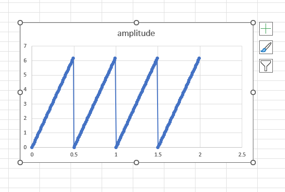
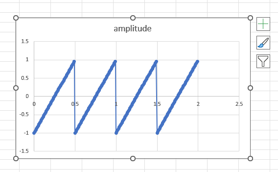

# Introduction
<b>--- 25-07-2026 10:59 SATURDAY ---</b>
  
Lately, while working on my "audio-tools-and-effects" library and learning about Audio DSP with Claude, I realised I was moving too fast. I have created this repository to slow down and relearn everything again. Use Google, documentations, etc.
  
I'll start with a basic oscillator and keep a Log file for each branch I create. It will help me document my true learnings which I can refer to later and maybe even help someone else.
  

# Ideas
## <b>--- 25-07-2026 11:02 SATURDAY ---</b>
Create a simple script which produces values which mimic a sine wave. The script should write values to a CSV file. 
  
<b>X -></b> time (assume 44100 values in 1 second)
 
<b>Y -></b> amplitude (keeps shifting between -1 and +1)
### TODO
1. Create a function which generates a sine wave and the returns an array with values ranging from -1 to +1.
2. Create a function which accepts an array of double values and assigns it to the Y column. Generation of X values to happen in the function itself based on the sample count. This function also writes to a .csv file.
### Implementation Notes
1. Basic boilerplate code. Then went on to the whiteboard 
1. Then I realised that my idea of thinking about cycles was wrong when it came to mapping the positive and negative phase
1. A big realisation: I forgot to include the frequency of the wave. Once I added that, the next thing left to do was to try to come up with a formula for phase_increment in relation to frequency
1. After going back and forth and googling some concepts I realised that my entire idea of what phase is was wrong. I found out:
    1. Adding the same amount every sample gives me something else. A triangle of sorts.
    1. Phase is not a +1 or -1 value but a position in the wave/circle.
    1. The idea is to store this position and map it to an amplitude.
    1. Frequency is how many waves per second are generated. With this, it is clear that in 1 second, with the given rate of 44100, the number of cycles will be 100 (since frequency is 441).
    1. So, phase_increment = 2 * pi * frequency / sample_rate
    1. [AI Summarized Thought Process](./sine/AI_CONVERSATION_SUMMARY.md)
### C++ Findings
1. `std::vector<T>(n)` value-initializes its elements (`0.0` for `double`).
2. Prefer `std::vector` over variable-length arrays (VLAs); VLAs are not part of standard C++.
3. Prefer `const T&` over passing large objects by value when only read access is needed.
4. References use `.` to access members, pointers use `->`.
5. `std::vector::size()` returns `std::size_t`, so use `std::size_t` for container sizes and indices.
6. `std::vector::at()` performs bounds checking; `operator[]` does not.
7. In performance-critical code, `operator[]` is preferred once index correctness has been established.
8. `std::ofstream` creates files automatically but does not create missing directories.
9. `std::ofstream` closes itself automatically when it goes out of scope (RAII).
10. `std::ofstream::is_open()` can be used to verify that the file was opened successfully.
11. A `void` function cannot return a value (e.g., `return 1;` is invalid).
12. `std::format` and `std::numbers` require compiling with C++20 (`-std=c++20`).
13. Dividing an integer by a `double` performs floating-point division automatically.
14. Cache repeated calls like `samples.size()` in a local variable when they are used frequently.
15. Pass containers directly instead of raw pointers unless `nullptr` is a meaningful state.
16. Prefer `const` for values that never change (e.g., `phase_increment`).
17. Use compiler warnings (`-Wall -Wextra -pedantic`) to catch non-portable or suspicious code early.
18. A relative file path is resolved from the program's current working directory, not the source file's location.
## <b>--- 25-07-2026 18:53 SATURDAY ---</b>
Same but a square wave this time.
### Implementation Notes
1. Pretty easy logic
1. When phase is < pi samples should be +1 and when > pi -1. 
1. Phase rotation works same as sine wave.
### C++ Findings
1. The `%` operator only works with integral types (`int`, `char`, `long`, etc.). It cannot be used with `float` or `double`.
   1. This is because `%` is defined as the **integer remainder** operator.
   2. For floating-point values, there isn't a natural notion of an integer remainder, since the quotient itself can also be a floating-point number. For example, `7.5 / 2.4 = 3.125`, so the remainder is mathematically `0`.
   3. If you want the remainder after forcing the quotient to be an integer, use `std::fmod()`.
## <b>--- 25-07-2026 23:06 SATURDAY ---</b> (Positive Black Soul - Respect Da Nubian)
Same but a saw wave this time.
### Implementation Notes
1. Arrived at this: 
1. Now I need to simply push it down by 3 (6 is the max)
1. Then I realised I need to push it down by pi. So, I did. 
1. Eureka: sample value is literally mapping [0,2pi) -> [0,2) -> [-1,1)
1. "Which side of the circle am I on?" - Square Wave
1. "how far through one revolution you've travelled" - Saw Wave
1. each oscillator is just a different answer to the second question:
    1. Sine: "Take the y-coordinate."
    1. Square: "Return one of two levels depending on which half of the cycle I'm in."
    1. Sawtooth: "Return my progress through the cycle, mapped from [0, 2π) to [-1, 1)."