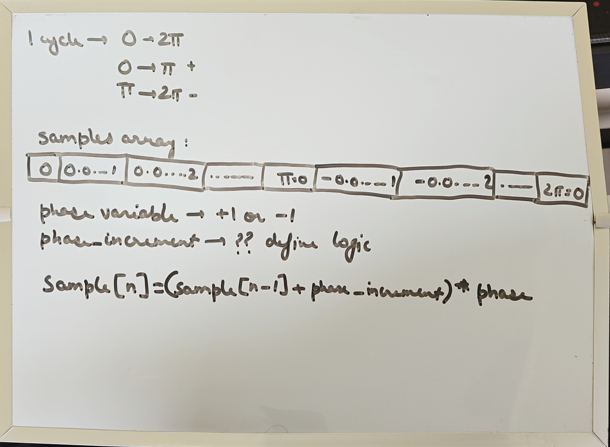
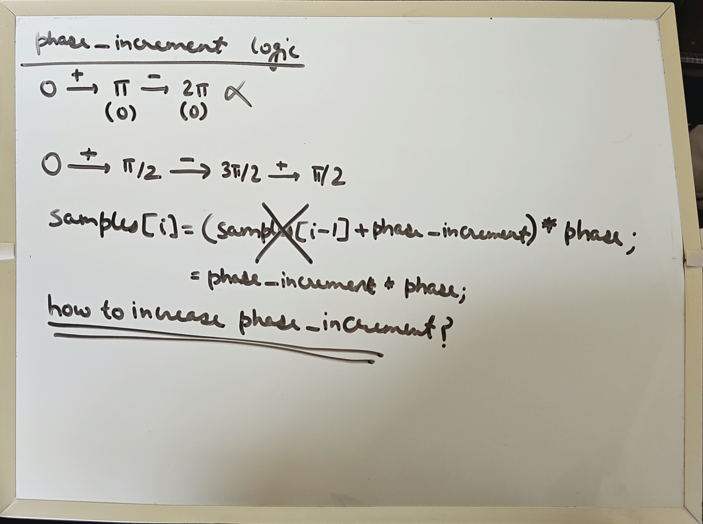
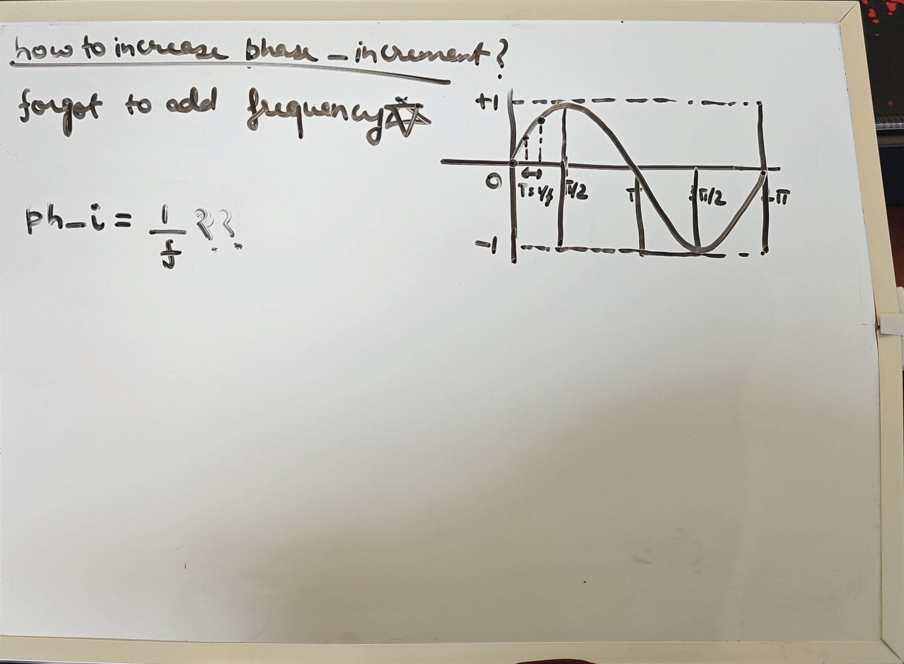

# Introduction
<b>--- 25-07-2026 10:59 SATURDAY ---</b>
  
Lately, while working on my "audio-tools-and-effects" library and learning about Audio DSP with Claude, I realised I was moving too fast. I have created this repository to slow down and relearn everything again. Use Google, documentations, etc.
  
I'll start with a basic oscillator and keep a Log file for each branch I create. It will help me document my true learnings which I can refer to later and maybe even help someone else.
  

# Ideas
## Idea 1 --- 25-07-2026 11:02 ---
Create a simple script which produces values which mimic a sine wave. The script should write values to a CSV file. 
  
<b>X -></b> time (assume 44100 values in 1 second)
 
<b>Y -></b> amplitude (keeps shifting between -1 and +1)
### TODO
1. Create a function which generates a sine wave and the returns an array with values ranging from -1 to +1.
2. Create a function which accepts an array of double values and assigns it to the Y column. Generation of X values to happen in the function itself based on the sample count. This function also writes to a .csv file.
### Implementation Notes
1. Basic boilerplate code. Then went on to the whiteboard 
1. Then I realised that my idea of thinking about cycles was wrong when it came to mapping the positive and negative phase
1. A big realisation: I forgot to include the frequency of the wave. Once I added that, the next thing left to do was to try to come up with a formula for phase_increment in relation to frequency
1. After going back and forth and googling some concepts I realised that my entire idea of what phase is was wrong. I found out:
    1. Adding the same amount every sample gives me something else. A triangle of sorts.
    1. Phase is not a +1 or -1 value but a position in the wave/circle.
    1. The idea is to store this position and map it to an amplitude.
    1. Frequency is how many waves per second are generated. With this, it is clear that in 1 second, with the given rate of 44100, the number of cycles will be 100 (since frequency is 441).
    1. So, phase_increment = 2 * pi * frequency / sample_rate
    1. [AI Summarized Thought Process](./sine/AI_CONVERSATION_SUMMARY.md)