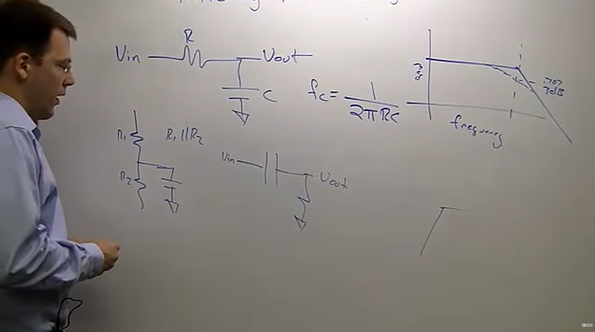
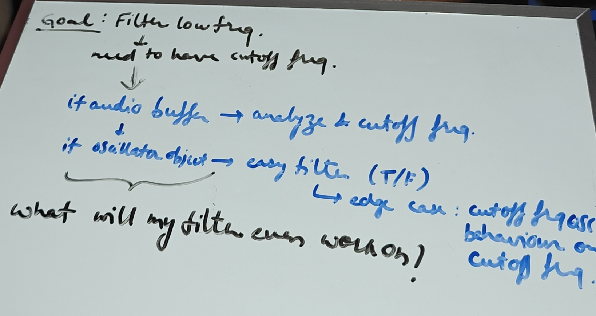
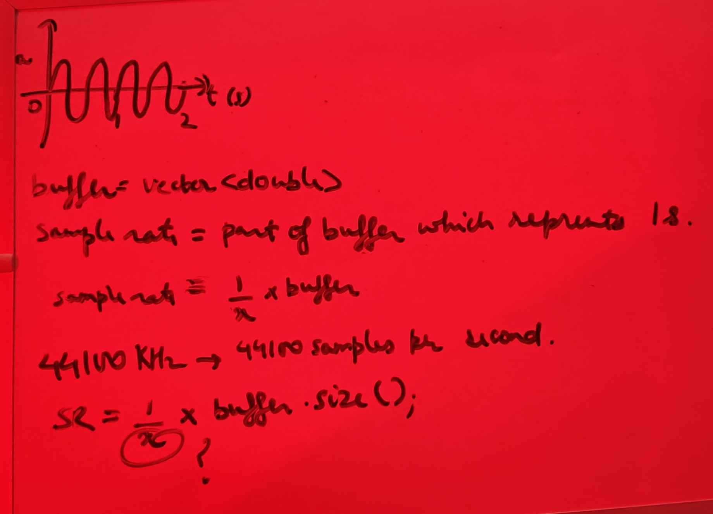
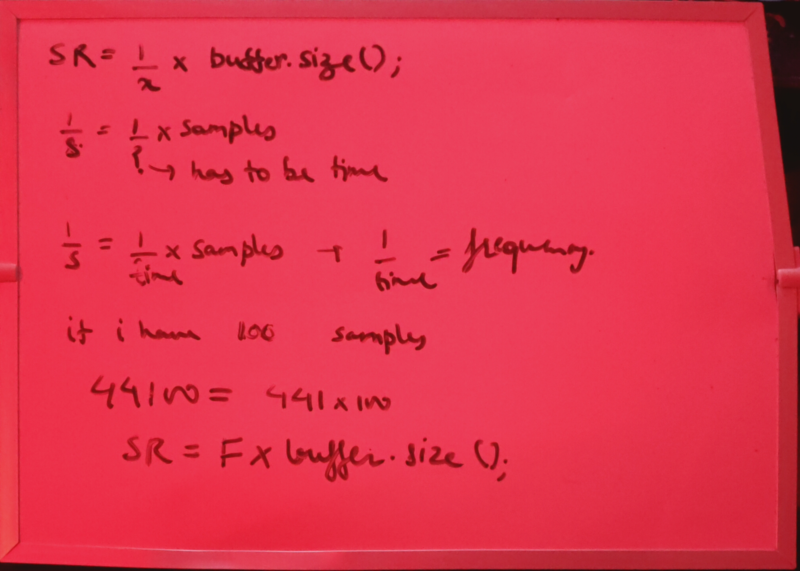
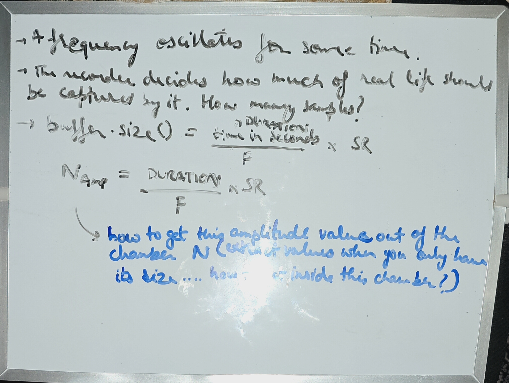

# Introduction
<b>--- 27-07-2026 20:32 MONDAY ---</b>
<br/><br/>
1. One Pole LPF from scratch. No AI.
1. 20.33 -> Try to go into absolute depth and take a week to solve it. Next Monday review. Before Leh.
1. 20.41 -> So, the electrons that start out in full energy and then slowly dissipiate.. the one who decays more is filtered out. The one who couldn't bear the resistor. 
    1. Which is why a low pass filter always needs some sort of a resistance first.
    1. But for the high pass, it's the opposite. You're only allowed to pass if your source... what does a capacitor do to electrons?
        1. OKay so it just stops the electrons and traps it by pulling it away from the source.
    1. So, for a high pass, the electron which has the .. can an electron with high energy cross a capacitor?
        1. No, it can't.
    1. <b>TODO: Revisit this</b> 
1. 20.42 ->
    1. what does a capacitor do to electrons?
    1. [1](https://ocw.mit.edu/courses/res-6-008-digital-signal-processing-spring-2011/video_galleries/video-lectures/)
    1. [2](https://phys.libretexts.org/Special:Search?qid=&fpid=230&fpth=&query=one+pole+low+pass&type=wiki)
    1. [3](https://www.dspguide.com/ch19/2.htm)
    1. [4](https://dsp.stackexchange.com/questions/54086/single-pole-iir-low-pass-filter-which-is-the-correct-formula-for-the-decay-coe)
    1. [5](https://www.youtube.com/watch?v=ftk9C45F_bo)
    1. [6](https://www.reddit.com/r/synthesizers/comments/ba75tl/what_are_poles_in_filters/)
    1. [7](https://www.youtube.com/watch?v=Sq0mQFwYTIk&t=49s)
    1. [9](https://www.youtube.com/watch?v=oHKwwvcn77Y)
    1. does reistance cause higfh energy electrons to stop
    1. [10](https://www.youtube.com/watch?v=oztGhZF11uo)
    1. [11](https://www.youtube.com/watch?v=I8_E1ppC3-Q&t=35s)
    1. is one pole low pass filter an IIR
    1. how is one pole low pass filter and iir
    1. what is an iir filter
        1. [12](https://in.mathworks.com/help/signal/ug/iir-filter-design.html)
    1. how does a one pole low pass filter work
        1. [13](https://www.embeddedrelated.com/showarticle/779.php)
1. 20.59 -> Filter Low Pass, only pass low frequncies, how do i get frequency from the buffer? 
    1. works with individual oscillators but what about noise or just being passed a buffer?
    1. Should explore this when done with theory.
    1. 21.02 -> No, this.
1. 21.09 -> Goal is: Filter low frequency 
    1. need to have cutoff frequency
1. 21.23 -> Need to find relationship between amplitude and frequency.
    1. More amplitude may imply a higher energy sample.. so it can kind of relate to my freuqncy. Higher frequency sounds louder?
        1. But is loudness dependent on frequency?
            1. Google says yes. 21.30 -> Let's assume this first and go with it. Later come back to this.
            1. 21.31 -> Fletcher-Munson curve
        1. So let's assume that loudness is equal to frequency in a way.. then I need to:
            1. Figure out the mathematical relationship between frequency and amplitude
                1. 21.26 -> Figure out the mathematical relationship between frequency and amplitude
                    1. 21.28 -> The only thing I will have is a buffer and the sample rate. Figure out according to that.
                            1. 
                        1. 21.36 -> what is x?
                            1. 21.42 -> TOMORROW
                            1. 21.43 -> Till 10PM.
                            1. 21.46 -> ``` SR = F * buffer.size() ``` !!! 
                    1. 21.48 -> So, id SR = F * buffer.size()
                        1. 21.50 -> but i can have a wave of 10000s and the buffer size would be quite high despite SR being 44100 and F being 441
                            1. So, the equation is wrong
                                1. PROJECT_IDEA: Git repo inside another git repo
                        1. 21.57 -> But duration can also be included here in the equation!
                            1. 22.03 -> TOMORROW 
            1. Figure out how to actually filter once the relationship is derived
<b>--- 28-07-2026 11:23 MONDAY ---</b>
<br/><br/>
1. First of all ```buffer.size()``` is simply ```SR * DURATION```.. the approach itself was wrong.
1. Keep it simple. Create a naive filter.
    1. Imagine a filter knob that can be used. Knob goes from 0 to 1.
    1. ```Filtered value = (1 - KNOB_VALUE) * sample[i] ``` That's it!
    1. Then figure out how to make it low pass or high pass. Right now it just cuts things off.
    1. 11.32 -> Should filter give only the value that should be subtracted or should it filter and give it?
        1. Let it give the filtered value
## C++ Findings